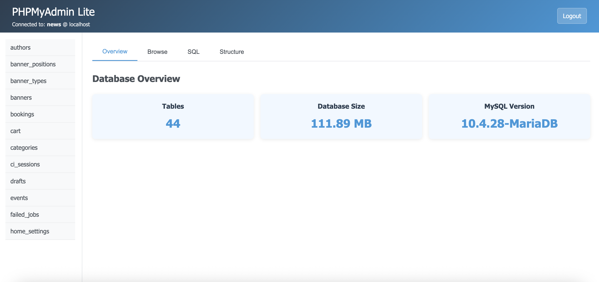

# Enhanced PHPMyAdmin (Lightweight MySQL Client)

A minimal, single-file PHP-based MySQL client inspired by PHPMyAdmin — reimagined with simplicity, speed, and developer productivity in mind.

---

## 🚀 Features

- Connect to any MySQL/MariaDB database easily  
- Clean, tab-based interface (Overview, Browse, SQL, Structure)  
- View total tables, database size, and MySQL version  
- Browse and export table data (CSV)  
- View table schema (columns, types, keys)  
- Run custom SQL queries  
- Lightweight and minimal UI 
- No external libraries or dependencies  

---

## 📁 Project Structure

```
enhanced-phpmyadmin/
├── index.php          # Main single-file app
├── assets/            # Optional (e.g., for screenshot or favicon)
└── README.md
```

---

## ⚙️ Requirements

- PHP 7.2 or higher  
- MySQL or MariaDB server  
- Web server (Apache, Nginx, or PHP built-in server)

---

## 🛠️ Setup & Usage

1. Clone or Download

   ```bash
   git clone https://github.com/reeteshjee/phpmyadmin-lite.git
   cd enhanced-phpmyadmin
   ```

2. Run the PHP built-in server (for quick testing)

   ```bash
   php -S localhost:8000
   ```

3. Open in your browser

   Visit: http://localhost:8000

4. Connect to your MySQL Database

   Provide:
   - Host (e.g., localhost)
   - Username (e.g., root)
   - Password
   - Database Name

---

## 🧩 Tabs Overview

**Overview**  
- Displays number of tables  
- Total DB size (in MB)  
- MySQL version  

**Browse**  
- List rows from selected table  
- Copy to clipboard  
- Export to CSV  

**SQL**  
- Run custom SQL queries  
- Shows result or error message  

**Structure**  
- Lists column names, data types, keys, and nullability  

---

## 🔐 Security Warning

This tool is meant for **development** or **local usage only**.

❗ Do NOT expose this tool publicly without proper authentication and HTTPS.

---

## 📸 Screenshot (optional)

You can add a screenshot here:



---

## 📄 License

MIT License  
© 2025 Ritesh Ghimire

---

## 🙋‍♂️ Author

**Ritesh Ghimire**  
GitHub: https://github.com/reeteshjee  
Website: https://reeteshghimire.com.np 
YouTube: https://www.youtube.com/c/letstrythis  

---

## 💬 Contributions

Feel free to fork, customize, and contribute. PRs are welcome if you'd like to modularize or enhance functionality.
